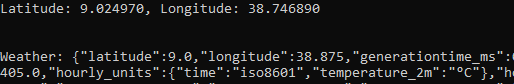

This is a [Go Programming Language](https://go.dev/) project.

## Getting Started

First, run on Command Prompt:

```bash
go mod init go_weather_forecast
# then
go mod tidy
# to see the result
go run .
```
  